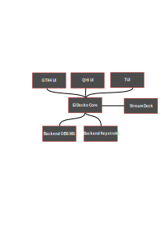

# El Decko Core
This is the core of El Decko.  
It serves as the glue between any backend, the Stream Deck  and any given user interface.

If writing news user interfaces please target the core instead of using any or multiple backends directly.  
Also don't provide Stream Deck related functionality directly in the UI but seek to add missing stuff here.

## Develop El Decko
If you're using virtualenv to develop El Decko I advise to not use separate venvs for each component but to install them  
all in the same environment simply do the following: `pip install --editable .` on all backends, the core and UIs  
and simply use them as they were properly installed on your system.  
Since in development modules can't be pushed to the pip registry this is, afaik, the best way to develop and test all  
components together.  
Changes on the python code will take effect imminently.  
Only if you change the pyproject.toml files you need to re-run `pip install --editable .` to let this  
changes take effect.

### lib-hidapi and flatpak
If you happen to run PyCharm from flatpak (as I do) it will not be able to access `libhidapi-libusb.so` from the host.  
To workaround this issue simply run `pip install --editable .` in a terminal on your host OS which is not sandboxed by  
flatpak.  
Until I found a way to resolve this issue inside the flatpak runtime El Decko can't be provided as a flatpak. :/  
I am really sorry for this.

## Standalone
If you do not want to run El Decko using any UI but just want it to sit silently in the background and waiting for key press events on your Stream Deck you can run it as a stand-alone program after installing it via pip as follows: `ed-core`  
But keep in mind that any change on your configuration files will require you to quit and restart El Decko manually and don't close the terminal window as this might exit the program as well.  

### First run
Upon the first run El Decko Core will create an empty default configurations file at `$XDG_CONFIG/eldecko`.  
The default path is: `$HOME/.config/eldecko`

## Available backends
- [OBS Studio Websocket](https://github.com/Z-Ray-Entertainment/el_decko_backend_obs_ws)
  * This backend function by using OBS Studios websocket server.
  * This way it is display server agnostic
  * You need to enable the websocket server inside OBS and supply the plugin with the generated password.